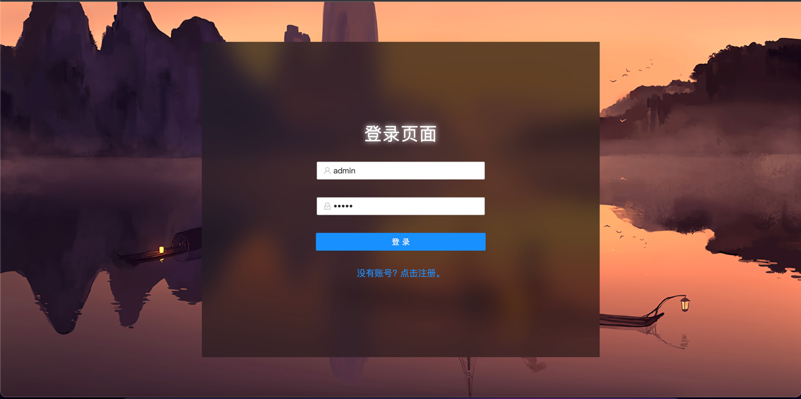
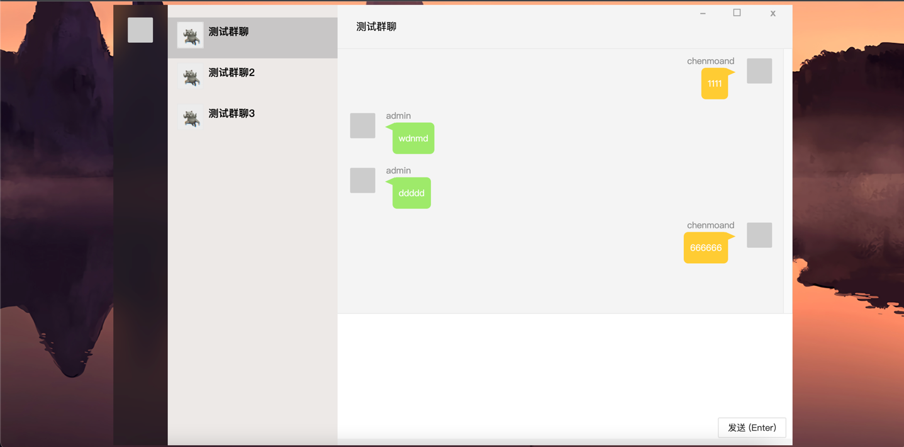

# WebMessage 一个简单的网页聊天项目

## 项目引用

后端 `SpringBoot` + `Mysql` + `Spring Data JPA` + `Mybatis(配置了但是没有用到)` ......

前端 `Vue3`  + `Axios` + `Antd design`

开发工具 `IDEA`, `Java 11`

## 使用方法

* 拷贝项目 [Github](https://github.com/mitu2/webmessage) 
* 修改application-dev.yml的Mysql相关配置
* 需要提前在mysql中创建好 `webmessage` Schema
* 然后在当前目录下运行 `cd vue && npm install && npm run build`
* 继续在当前目录下运行`mvn spring-boot:start -DskipTests`

## 项目运行效果

* 登陆

* 首页
